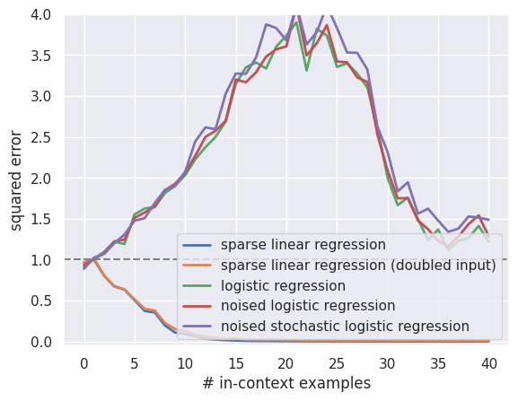
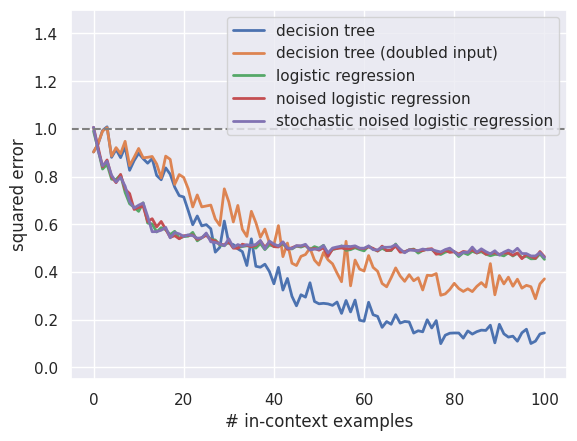
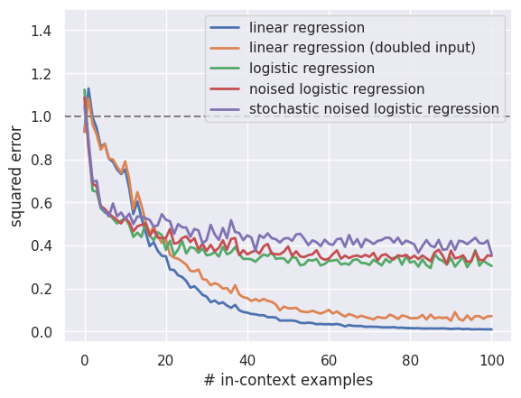

This repository contains reproduction and additional experiments for the following paper:

**What Can Transformers Learn In-Context? A Case Study of Simple Function Classes** <br>
*Shivam Garg\*, Dimitris Tsipras\*, Percy Liang, Gregory Valiant* <br>
Paper: http://arxiv.org/abs/2208.01066 <br><br>

My contribution is ```my_tf_eval.ipynb```. The other files are from Garg et al (2022).

## Getting started
You can start by cloning our repository and following the steps below.

1. Install the dependencies for our code using Conda. You may need to adjust the environment YAML file depending on your setup.

    ```
    conda env create -f environment.yml
    conda activate in-context-learning
    ```

2. Download [model checkpoints](https://github.com/dtsip/in-context-learning/releases/download/initial/models.zip) and extract them in the current directory.

    ```
    wget https://github.com/dtsip/in-context-learning/releases/download/initial/models.zip
    unzip models.zip
    ```

3. Please look at the ```in-context-learning/src/my_tf_eval.ipynb``` to reproduce the experiments as well as additional experiments to check the in-context learning ability to perform logistic regression of the transformer pretrained on various tasks


##  The main results
1. The result of the in-context learning ability of the transformer pretrained on the **linear regression task**
    *   The transformer model pretrained on the linear regression task fails to effectively in-context learn a logistic regression probably because the logistic regression is more general problem compared to the multiple linear regression
    *   We observe the double descent error curve for each logistic regression task particularly around the size of in-context examples is $20$, which is same as the dimension $d$ of the input $x$
    *   We also observe that the transformer pretrained on the linear regression task has worse performance when we consider the stochastic noisy and noisy logistic regression tasks compared to the standard logistic regression task with in-context examples larger than $20$
<p align="center">
  
</p>

2. The result of the in-context learning ability of the transformer pretrained on the **sparse linear regression task**
    *   The in-context learning ability of the transformer model pretrained on the sparse linear regression task is not affected so much by the scale of the input compared to the one pretrained on the standard linear regression
    *   The transformer model pretrained on the sparse linear regression task fails to effectively in-context learn a logistic regression probably probably due to the same reason as the one on the standard linear regression task
    *   Same as the result of the transformer pretrained on the linear regression task, we observe the double descent error curve
    *   We also observe that the transformer pretrained on the linear regression task has worse performance when we consider the stochastic noisy and noisy logistic regression tasks compared to the standard logistic regression task with in-context examples larger than $20$
<p align="center">
  
</p>


3. The result of the in-context learning ability of the transformer pretrained on the **decision tree task**
    *   The in-context learning ability of the transformer model pretrained on the decision tree task is hugely affected by the scale of the input compared to the one pretrained on the standard decision tree particularly with the larger in-context examples
    * the transformer model pretrained on the decision tree task fails to in-context learn a logistic regression task ragardless of noisiness and stochasticity, leading to the random prediction of the label since the mean squared erorr does not improve after reaching $1/2$
<p align="center">
  
</p>


4. The result of the in-context learning ability of the transformer pretrained on the **2-layer ReLU neural network task**
    *   The in-context learning ability to do a linear regression task of the transformer model pretrained on the 2-layer ReLU neural network task is affected by the scale of the input, incursing almost constant additional prediction error for a given number of the in-context examples after the model reachs the error $1/2$
    * The transformer model pretrained on the 2-layer ReLU neural network task performs an in-context learning for a logistic regression task probably due to the complex task it is trained on, but the performance is worse compared to the linear regression task.
<p align="center">
  
</p>

