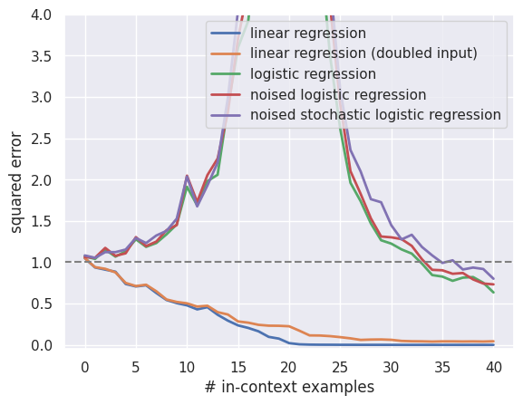

This repository contains reproduction and additional experiments for the following paper:

**What Can Transformers Learn In-Context? A Case Study of Simple Function Classes** <br>
*Shivam Garg\*, Dimitris Tsipras\*, Percy Liang, Gregory Valiant* <br>
Paper: http://arxiv.org/abs/2208.01066 <br><br>


## Getting started
You can start by cloning our repository and following the steps below.

1. Install the dependencies for our code using Conda. You may need to adjust the environment YAML file depending on your setup.

    ```
    conda env create -f environment.yml
    conda activate in-context-learning
    ```

2. Download [model checkpoints](https://github.com/dtsip/in-context-learning/releases/download/initial/models.zip) and extract them in the current directory.

    ```
    wget https://github.com/dtsip/in-context-learning/releases/download/initial/models.zip
    unzip models.zip
    ```

3. Please look at the ```in-context-learning/src/my_tf_eval.ipynb``` to reproduce the experiments as well as additional experiments to check the in-context learning ability to perform logistic regression of the transformer pretrained on various tasks


##  The main results
1. The result of the in-context learning ability of the transformer pretrained on the linear regression task
    *   The transformer model pretrained on the linear regression task fails to effectively in-context learn a logistic regression probably because the logistic regression is more general problem compared to the multiple linear regression
    *   We observe the double descent error curve for each logistic regression task particularly around the size of in-context examples is $20$, which is same as the dimension $d$ of the input $x$
    *   We also observe that the transformer pretrained on the linear regression task has worse performance when we consider the stochastic noisy and noisy logistic regression tasks compared to the standard logistic regression task with in-context examples larger than $20$
<p align="center">
  
</p>

